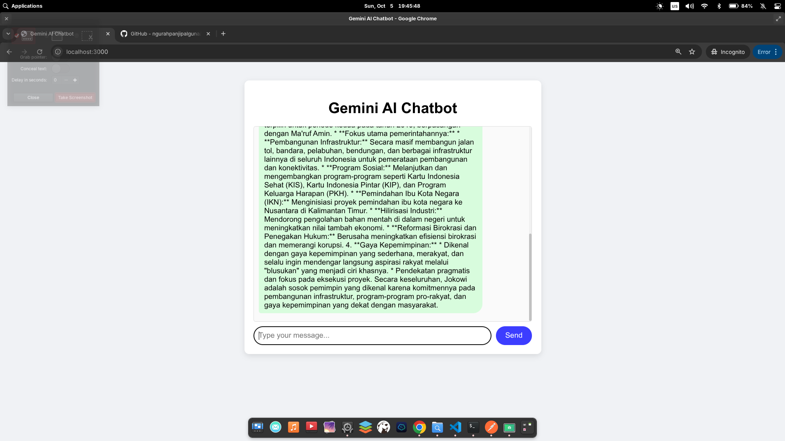

# Gemini Chatbot API

A simple chatbot application powered by Gemini AI with a web-based frontend interface.

## Project Overview

This project consists of:
- **Backend API**: Node.js server that handles Gemini AI integration
- **Frontend Interface**: Web-based chat interface accessible at localhost:3000

## Prerequisites

- Node.js installed on your system
- Gemini AI API key

## Installation & Setup

1. Clone or download this project
2. Install dependencies:
   ```bash
   npm install
   ```

3. Set up your Gemini API key in the configuration (if required)

## How to Run the Project

### Method 1: Simple Start
```bash
node index.js
```

This command will:
- Start the backend server automatically
- Make the frontend accessible at `http://localhost:3000`

### Method 2: Manual Start (if needed)
If you need to start components separately:

1. Start the backend:
   ```bash
   node index.js
   ```

2. Open your browser and navigate to:
   ```
   http://localhost:3000
   ```

## Usage

1. After running `node index.js`, wait for the server to start
2. Open your web browser
3. Go to `http://localhost:3000`
4. Start chatting with the Gemini-powered chatbot through the interface

## Features

- Real-time chat interface
- Integration with Gemini AI
- Simple and intuitive user interface
- Automatic backend-frontend coordination

## Notes

- The backend server starts automatically when you run `node index.js`
- The frontend is served from the same server on port 3000
- No additional configuration needed for basic usage

## Troubleshooting

- Ensure port 3000 is available on your system
- Verify that all dependencies are properly installed
- Check your internet connection for Gemini API access

  
